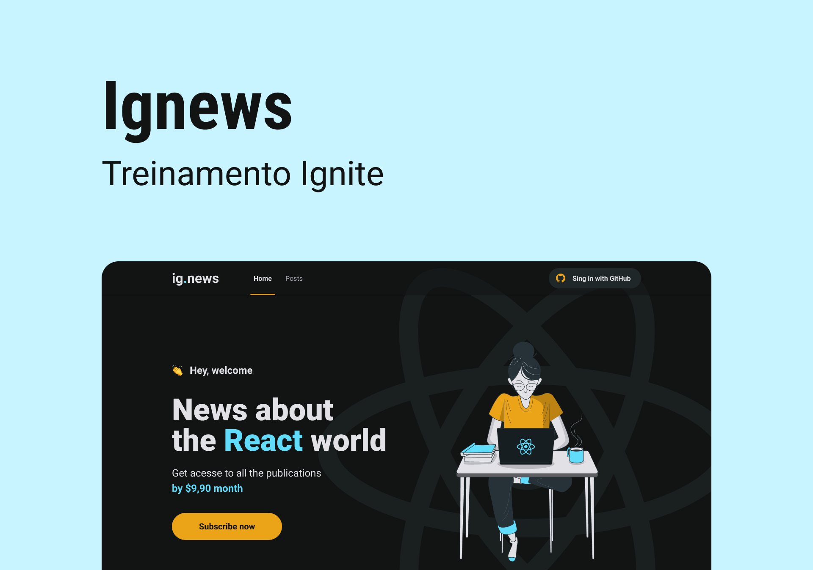

<div align="center"></div>

<div id='about'>
  <h1 align="center">
	  🚧  IgNews 🚀  🚧
  </h1>
  <p align="center">🚀 It's a NewsLetter application</p><br/>
</div>

# Tabela de conteúdos

<!--ts-->

- [About](#about)
- [How to run](#how-to-run)
  - [Requirements](#requirements)
- [Tecnologies](#technologies)
- [Features](#features)
- [Author](#author)
<!--te-->

## Getting Started

<div id='hot-to-run'>
  <h2>How to run</h2>

  <div id='requirements' display='flex' flex-direction='column'>
    <h3>To run this application you need to install:</h3>
    - [NodeJS](https://nodejs.org/)<br/>
    - [Git](https://git-scm.com/)<br/>
    - Além disto é bom ter um editor para trabalhar com o código como [VSCode](https://code.visualstudio.com/)
  </div>
  
  <br/>

First, download this repository to your machine:

```bash
git clone https://github.com/flvSantos15/feedback-widget.git
```

Go to the folder:

```bash
cd folder's name
```

Then, install dependencies by running:

```bash
yarn
# or
npm install
```

And finally, run the development server:

```bash
npm run dev
# or
yarn dev
```

Open [http://localhost:3000](http://localhost:3000) with your browser to see the result.

</div>

<div id='technologies'>
  <h2>This application is being built using the following technologies:</h2>
  
  - [React](https://pt-br.reactjs.org/)
  - [TypeScript](https://www.typescriptlang.org/)
  - [NextJS](https://nextjs.org/)
  - [Stripe](https://stripe.com/docs/js)
  - [FaunaDB](https://fauna.com/)
  - [Prismic-CMS](https://prismic.io/)
</div>

<div id='features'>
  <h2>Features developed during the classes</h2>

- [ x ] Web view
- [ x ] SignIn with github
- [ x ] Payment stripe's methods
- [ x ] database integration
- [ x ] subcription validation

</div>

<div id='author'>
  <h2>Autor</h2>

 
 <br />
 <sub><b>Flavio Santos</b></sub>

Built with ❤️ by Flavio Santos 👋🏽 get in touch!

[](https://www.linkedin.com/in/flvSantos15/)
[](mailto:flvSantos300@gmail.com)

</div>
